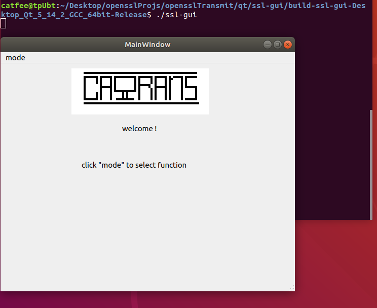
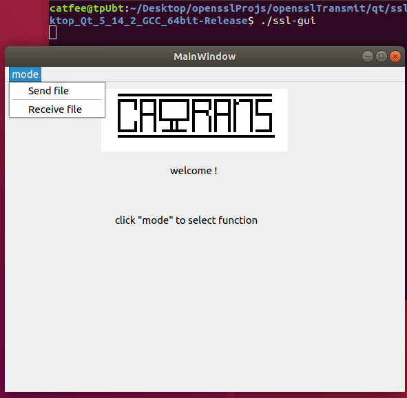
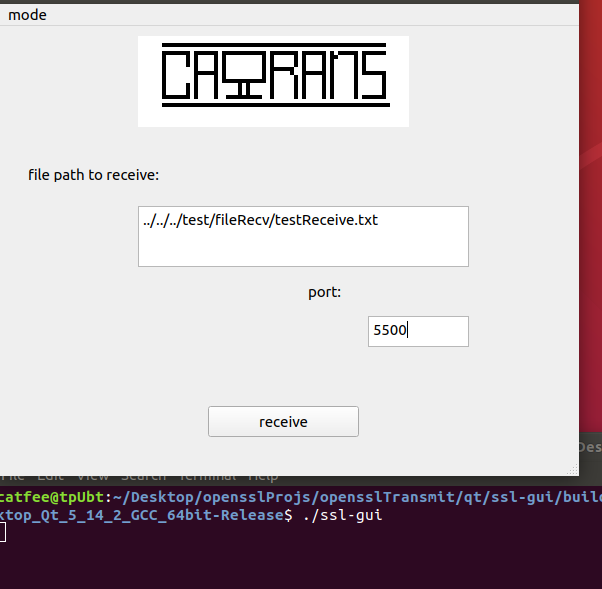
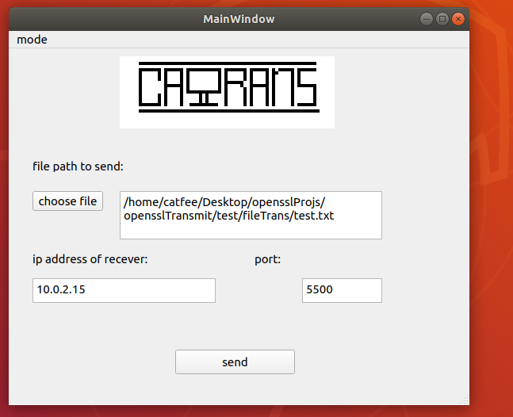
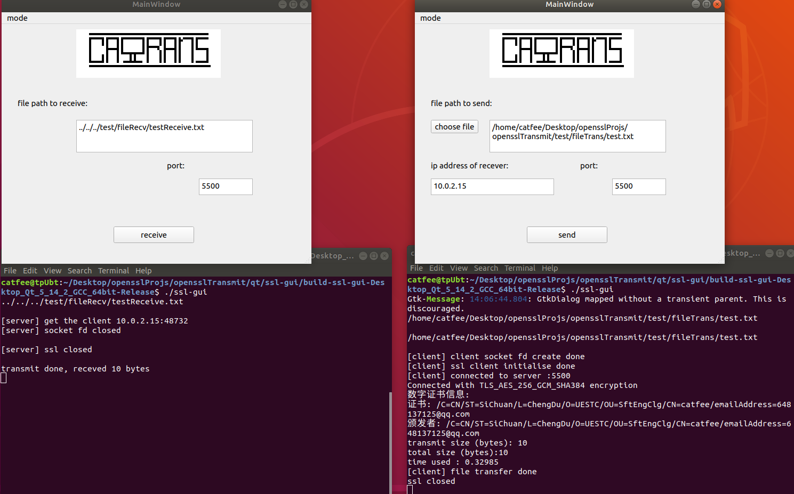
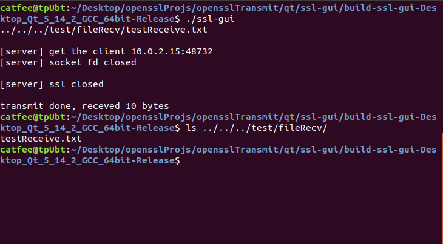

# opensslTransmit
## 基于openssl的加密文件传输软件

## main 分支
第一次更新的主分支
### 目录结构
```
.
├── bin
├── certs
├── debug
│   ├── bin
│   └── obj
├── imgs
├── include
├── obj
├── qt
│   └── ssl-gui
│       ├── build-ssl-gui-Desktop_Qt_5_14_2_GCC_64bit-Debug
│       ├── build-ssl-gui-Desktop_Qt_5_14_2_GCC_64bit-Release
│       └── ssl-gui
├── src
└── test
    ├── fileRecv
    └── fileTrans
```
### 依赖环境
`build-essential libssl-dev qt`
### 运行方法
1 安装依赖环境

openssl:

`$ sudo apt-get install libssl-dev`

qt:

`http://download.qt.io/official_releases/qt/`

2 下载源代码

`$ git clone https://github.com/ca1fee/opensslTransmit.git`


3 切换到目录

`$ cd opensslTransmit/qt/ssl-gui/build-ssl-gui-Desktop_Qt_5_14_2_GCC_64bit-Release/
`


4 运行客户端

`$ ./ssl-gui`



5 选择接收或发送



6 设定相应的参数

接收的设定



发送的设定



7 运行效果



**即可在test/fileRecv(或者指定的目录)找到传输的文件，格式为：clt.年.月.日.时.分.秒(或指定的目录和文件名)**


